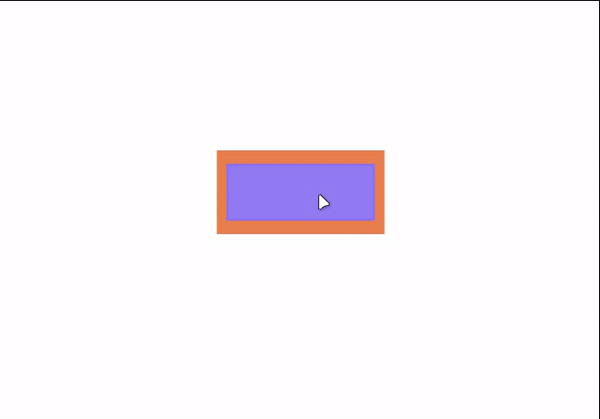
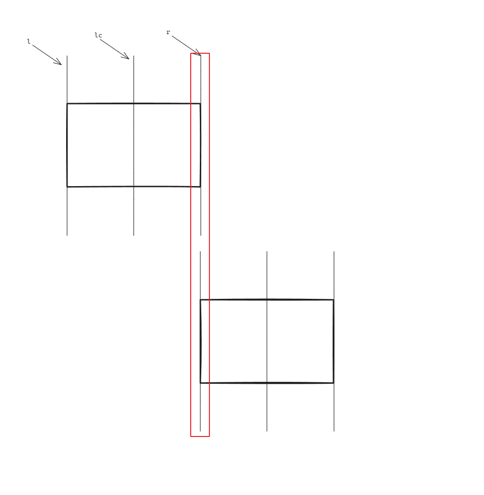

# leafer-x-line-helper



`leafer-ui` 辅助线插件，同时还支持吸附功能

## 使用

### 基本使用

```sh
# 安装依赖
pnpm i leafer-x-line-helper
```

```js
import { App, Rect, Frame } from 'leafer-ui'
import '@leafer-in/editor'

import { LineHelper } from 'leafer-x-line-helper'

const app = new App({ view: window, editor: {}, tree: {} })
const lineHelper = new LineHelper(app)
```

### 本地预览

```sh
# clone 项目
git clone https://github.com/YL-python/leafer-x-line-helper
# 进入目录
cd leafer-x-line-helper
# 安装依赖
pnpm i
# 进入预览目录
cd ./playground
# 安装依赖
pnpm i
# 允许项目
pnpm run dev
```

运行项目之后，访问 [http://127.0.0.1:5173/](http://127.0.0.1:5173/) 即可看到上面预览图的效果

## 配置

## 默认配置

```js
const config = {
  type: 'line',
  lineColor: '#3670f7',
  lineStyle: 'solid',
  lineWidth: 1,
  sticky: true,
  stickySpace: 4,
  vCompare: ['l', 'lc', 'r'],
  hCompare: ['t', 'tc', 'b'],
}
```

### 配置介绍

#### type

辅助线类型，默认 `line`

- none 表示不显示辅助线
- line 表示显示线型辅助线
- arrow 表示显示箭头辅助线(开发中)

#### lineColor

辅助线颜色

#### lineStyle

辅助线样式，默认 `solid`

- solid 实线
- dashed 虚线

#### lineWidth

辅助线宽度，默认 `1px`

#### sticky

是否开启吸附功能，默认开启

#### stickySpace

吸附距离，默认 `4px`，也就是两个节点之间距离小于 4px 时，两个节点会吸附在一起

#### vCompare

垂直方向比较类型，默认 `['l', 'lc', 'r']`

#### hCompare

水平方向比较类型，默认 `['t', 'tc', 'b']`

### vCompare、hCompare 参数说明



如图所示，一个矩形纵向可以被分成三部分，左边线`(l)`，中线`(lc)`，右边线`(r)`

在判断是否需要绘制辅助线的时候会遍历上面矩形的每一条线与下面矩形的每一条线是否在一条直线上，在一条直线上就会绘制辅助线

也就是说，在纵向方向上的判断就会有九种场景

如果你不想比较中线，可以将 `vCompare` 参数设置成 `['l', 'r']`，这样两个矩形在比较的时候就只会比较左边线和右边线，也就是，只会有 `2x2` 四种情况了

`hCompare` 参数同理，我将水平方向的比较也分成了三个部分 上边线`(t)`，中线`(tc)`，下边线`(b)`

注意：vCompare、hCompare 参数会同时影响到辅助线的绘制和吸附的判断

## 修改默认配置

```js
// 方式1，在初始化的时候传入参数
const lineHelper = new LineHelper(app, { stickySpace: '10px' })

// 方式2，调用 setConfig 方法
lineHelper.setConfig({ lineStyle: 'dashed' })
```

## 目前已知的一些问题以及后续打算

- [ ] todo：吸附的间距判断现在只能固定一个值，后期打算将吸附判断的值与画布缩放大小挂钩
- [ ] todo：辅助线支持箭头模式
- [ ] 问题：选中多个元数时，吸附效果不生效 (已排除到原因，待解决)
